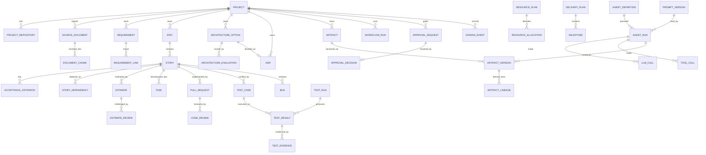

# 02 — Data Model

PostgreSQL 16 + `pgvector`. Prisma is the schema authority (`packages/database/prisma/schema.prisma`);
this document explains the *shape and the rules*, not every column.

## 1. Domain map

Eleven bounded groups. Arrows are foreign keys; everything ultimately hangs off `Project`.



## 2. Group 1 — Identity & Project

| Table | Purpose | Key columns |
|---|---|---|
| `users` | Humans. Local auth for MVP | `email`, `name`, `role` |
| `roles` | `ADMIN`, `PRODUCT`, `ARCHITECT`, `ENGINEER`, `QA`, `VIEWER` | |
| `project_members` | Per-project role assignment | `projectId`, `userId`, `role` |
| `projects` | Root aggregate | `key`, `name`, `status`, `phase`, `settings jsonb` |
| `project_repositories` | Multi-repo support (doc 51) | `role` (`FRONTEND`/`BACKEND`/`MOBILE`/`INFRA`/`SHARED`), `provider`, `url`, `defaultBranch`, `workspacePath` |
| `project_integrations` | Which MCP servers / design projects / trackers this project uses | `kind`, `serverId`, `externalRef`, `config jsonb` |

`projects.phase` is the pipeline stage shown in the dashboard:
`DISCOVERY → REQUIREMENTS → BACKLOG_DRAFT → BACKLOG_REVIEW → BACKLOG_APPROVED → ARCHITECTURE →
ARCHITECTURE_APPROVED → ESTIMATION → PLANNING → READY_FOR_DEVELOPMENT → IN_DEVELOPMENT → IN_QA →
RELEASE → COMPLETED`, plus `BLOCKED` and `HUMAN_INTERVENTION_REQUIRED`.

## 3. Group 2 — Discovery input

| Table | Purpose |
|---|---|
| `source_documents` | Meeting transcript, notes, email, spec, recording summary. `kind`, `title`, `content`, `occurredAt`, `participants jsonb`, `sha256` |
| `document_chunks` | Retrieval unit. `content`, `tokenCount`, `embedding vector(1536)`, `metadata jsonb`. HNSW index |

Everything the PO Agent produces cites `source_document_id` + character span, so a requirement can be
traced back to the sentence in the meeting that produced it.

## 4. Group 3 — Product (PO Agent output)

`product_visions`, `business_goals`, `stakeholders`, `requirements`, `business_rules`, `constraints`,
`assumptions`, `open_questions`, `product_decisions`, `risks`.

`requirements` is the hub:

| Column | Notes |
|---|---|
| `ref` | `REQ-014`, unique per project |
| `type` | `FUNCTIONAL` / `NON_FUNCTIONAL` / `BUSINESS_RULE` / `CONSTRAINT` |
| `priority` | `MUST` / `SHOULD` / `COULD` / `WONT` (MoSCoW) |
| `statement`, `rationale`, `acceptanceNotes` | |
| `confidence` | 0–1, PO Agent self-reported |
| `status` | `DRAFT` / `REVIEW` / `APPROVED` / `SUPERSEDED` |
| `sourceRefs jsonb` | `[{documentId, span:[start,end]}]` — traceability to raw input |

`requirement_links` records `DERIVES_FROM`, `CONFLICTS_WITH`, `DUPLICATES`, `REFINES` between
requirements — this is how the BA Agent reports conflicts and duplicates as *data*, not prose.

## 5. Group 4 — Backlog (BA Agent output)

| Table | Notes |
|---|---|
| `epics` | `ref` (`EP-3`), `title`, `goal`, `orderIndex` |
| `stories` | The full doc-8 schema: `ref` (`US-142`), `title`, `userStory`, `businessValue`, `description`, `priority`, `status`, `labels text[]`, `definitionOfReady jsonb`, `functionalRequirements jsonb`, `nonFunctionalRequirements jsonb`, `edgeCases jsonb`, `risks jsonb`, `assumptions jsonb`, `sizeSignal` |
| `acceptance_criteria` | `given`, `when`, `then`, `orderIndex`, `kind` (`GWT` / `CHECKLIST`) |
| `story_dependencies` | `fromStoryId`, `toStoryId`, `kind` (`BLOCKS` / `RELATES` / `SPLIT_FROM` / `MERGED_INTO`) |
| `story_requirements` | Join: which requirements a story satisfies (traceability) |
| `story_quality_flags` | BA self-detection: `DUPLICATE`, `AMBIGUOUS`, `TOO_LARGE`, `MISSING_AC`, `TECHNICAL_AS_BUSINESS`, `MISSING_EDGE_CASES`, `CONFLICTING` with `detail` and `resolved` |

`stories.status`: `DRAFT → REVIEW → CHANGES_REQUESTED → APPROVED → PLANNED → IN_PROGRESS →
IN_REVIEW → IN_QA → DONE → REJECTED`.

Story-level approval and backlog-level approval are distinct: a `BACKLOG_APPROVED` gate requires every
non-rejected story to be `APPROVED`.

## 6. Group 5 — Architecture

| Table | Notes |
|---|---|
| `architecture_options` | One row per option (A/B/C). Holds the full doc-11 payload as typed JSON: `overview`, `components`, `dataFlow`, `apiStrategy`, `databaseStrategy`, `caching`, `authn`, `authz`, `security`, `scalability`, `observability`, `deployment`, `cicd`, `infrastructure`, `costConsiderations`, `devComplexity`, `opsComplexity`, `advantages`, `disadvantages`, `risks`, `migrationStrategy`, `diagramMermaid` |
| `architecture_evaluations` | Written by the **Critic**, never the author. `optionId`, `criterion`, `score` (0–10), `weight`, `reasoning` |
| `architecture_recommendations` | `recommendedOptionId`, `reasoning`, `tradeoffs`, `risks`, `switchConditions` |
| `adrs` | Immutable once `APPROVED`. `number`, `title`, `context`, `problem`, `optionsConsidered`, `decision`, `rationale`, `consequences`, `risks`, `alternativesRejected`, `approvedByUserId`, `approvedAt`, `supersededByAdrId` |

Criteria enum: `DEVELOPMENT_SPEED`, `COST`, `SCALABILITY`, `SECURITY`, `MAINTAINABILITY`,
`OPERATIONAL_COMPLEXITY`, `TEAM_FIT`, `PERFORMANCE`, `FUTURE_EXTENSIBILITY`, `RISK`.

**Rule:** `architecture_evaluations.agentRunId` must reference a run whose agent is
`architecture-critic`. A DB check plus a runtime assertion prevents an author from grading itself.

## 7. Group 6 — Estimation & planning

| Table | Notes |
|---|---|
| `estimates` | Per story per estimator run. `storyPoints`, `hoursEngineering`, `hoursQa`, `hoursFrontend`, `hoursBackend`, `hoursDevops`, `hoursDesign`, `hoursSecurity`, `riskBuffer`, `confidence` (0–1), `riskLevel`, `rangeLowHours`, `rangeHighHours`, `assumptions jsonb`, `estimatorKind` (`PRIMARY` / `INDEPENDENT`) |
| `estimate_reviews` | Variance analysis across two independent estimates. `variancePct`, `status` (`ACCEPTED` / `ESTIMATION_REVIEW_REQUIRED`), `reconciledHours` |
| `resource_plans` | `estimatedDurationWeeks`, `parallelizationNotes`, `bottlenecks jsonb`, `criticalDependencies jsonb` |
| `resource_allocations` | `role`, `headcount` (decimal — 0.25 FTE is valid), `skills text[]`, `fteAllocation` |
| `delivery_plans` | `strategy`, `criticalPath jsonb` |
| `milestones` | `name`, `orderIndex`, `targetDate`, `storyIds` |
| `tasks` | Implementation tasks under a story. `kind` (`FRONTEND`/`BACKEND`/`DB`/`INFRA`/`TEST`/`DESIGN`), `repositoryId`, `estimateHours` |

Estimates are **never** presented as commitments: the API refuses to serialise an estimate without
`confidence` and `rangeLowHours`/`rangeHighHours`.

## 8. Group 7 — Development

| Table | Notes |
|---|---|
| `branches` | `storyId`, `repositoryId`, `name`, `baseBranch`, `headSha` |
| `pull_requests` | `provider`, `externalId`, `number`, `url`, `title`, `body`, `state`, `storyId`, `repositoryId`, `figmaRefs jsonb`, `adrId`, `checksState`, `mergedAt` |
| `code_reviews` | `prId`, `reviewerKind` (`AI` / `HUMAN` / `SECURITY_AI`), `verdict` (`APPROVE`/`REQUEST_CHANGES`/`REJECT`/`COMMENT`), `summary`, `agentRunId`, `userId` |
| `review_comments` | `path`, `line`, `severity`, `category`, `body`, `resolved` |
| `pr_fix_iterations` | Enforces `MAX_PR_FIX_ITERATIONS`. `prId`, `iteration`, `triggeredBy`, `outcome` |
| `design_references` | `storyId`, `figmaFileKey`, `nodeId`, `name`, `thumbnailUrl`, `payload jsonb` |

## 9. Group 8 — Quality

| Table | Notes |
|---|---|
| `test_cases` | Full doc-24 schema. `ref` (`TC-88`), `storyId`, `title`, `objective`, `preconditions`, `testData jsonb`, `steps jsonb`, `expectedResult`, `priority`, `type`, `automationStatus` |
| `test_suites` | Grouping, `kind` (`SMOKE`/`REGRESSION`/`STORY`) |
| `test_runs` | `trigger`, `commitSha`, `prId`, `environment`, `startedAt`, `finishedAt`, `summary jsonb` |
| `test_results` | `testCaseId`, `runId`, `status` (`PASS`/`FAIL`/`SKIP`/`ERROR`), `durationMs`, `failureMessage` |
| `test_evidence` | `resultId`, `kind` (`SCREENSHOT`/`VIDEO`/`TRACE`/`CONSOLE_LOG`/`NETWORK_LOG`/`REPORT`), `storagePath`, `contentType` |
| `bugs` | `ref` (`BUG-12`), `storyId`, `testCaseId`, `severity`, `title`, `description`, `reproSteps jsonb`, `rootCauseAnalysis`, `status`, `fixPrId` |
| `qa_fix_iterations` | Enforces `MAX_QA_FIX_ITERATIONS` |

## 10. Group 9 — Artifacts, versioning & lineage

The backbone of auditability.

```
artifacts (logical document)          artifact_versions (immutable snapshots)
├─ id                                 ├─ artifactId
├─ projectId                          ├─ version           (1, 2, 3 …)
├─ kind   'backlog' | 'architecture'  ├─ contentJson       jsonb
│         | 'requirements' | 'adr'    ├─ contentSha256     unique per artifact
│         | 'estimate' | 'test-plan'  ├─ status            DRAFT | REVIEW | APPROVED | SUPERSEDED
├─ scope  project | story | option    ├─ producedByRunId   → agent_runs
└─ currentVersionId                   ├─ approvedByUserId, approvedAt
                                      └─ createdAt
```

`artifact_lineage(childVersionId, parentVersionId, relation)` records exactly which input versions
produced an output version. Relations: `DERIVED_FROM`, `REVISION_OF`, `CRITIQUE_OF`, `SUPERSEDES`.

**Immutability rules (I3):**
1. `artifact_versions` rows are insert-only for `contentJson` and `contentSha256`.
2. A trigger rejects any `UPDATE` to a row whose `status = 'APPROVED'` except setting
   `status = 'SUPERSEDED'`.
3. Revising an approved artifact creates version *n+1*; it never mutates *n*.

Naming for the UI matches doc 42: `requirements-v1`, `backlog-v2`, `architecture-option-a-v1`,
`architecture-decision-v1`, `estimate-v1`, `test-plan-v1`.

## 11. Group 10 — Agent execution & audit

| Table | Purpose |
|---|---|
| `agent_definitions` | Versioned agent config (doc 04). `key`, `version`, `role`, `modelPolicy jsonb`, `permissions jsonb`, `inputSchemaRef`, `outputSchemaRef`, `maxRetries`, `timeoutSeconds`, `budget jsonb`, `enabled` |
| `prompt_versions` | `agentKey`, `version`, `path`, `sha256`, `body`, `createdAt`. Loaded from `prompts/**` and pinned per run |
| `agent_runs` | One agent execution. `projectId`, `agentKey`, `agentVersion`, `promptVersionId`, `workflowId`, `runId`, `activityId`, `attempt`, `status`, `inputRefs jsonb`, `outputVersionId`, `startedAt`, `finishedAt`, `durationMs`, `error jsonb`, `decisionSummary jsonb` |
| `llm_calls` | `agentRunId`, `provider`, `modelId`, `billingMode`, `promptTokens`, `completionTokens`, `cachedTokens`, `costUsd`, `latencyMs`, `finishReason`, `requestSha256` |
| `tool_calls` | `agentRunId`, `serverId`, `toolName`, `argumentsRedacted jsonb`, `status`, `durationMs`, `error`, `permissionDecision` |
| `usage_records` | Rolled-up cost/token accounting keyed by `projectId`, `workflowId`, `agentKey`, `storyId`, `modelId` |

`decisionSummary` is the *auditable* explanation surfaced in the UI (doc 54): claims, evidence
(artifact refs), assumptions, risks, tradeoffs. Raw chain-of-thought is never requested or stored
(I9).

## 12. Group 11 — Orchestration, approvals, config, events

| Table | Purpose |
|---|---|
| `workflow_runs` | Mirror of Temporal executions for joins/UI: `workflowId`, `runId`, `type`, `projectId`, `storyId`, `status`, `startedAt`, `closedAt`, `parentWorkflowId` |
| `approval_gates` | Configurable gate definitions per project: `key`, `requiredRole`, `enabled`, `timeoutHours`, `autoApprove` |
| `approval_requests` | `projectId`, `gateKey`, `workflowId`, `signalName`, `artifactVersionId`, `status`, `requestedAt`, `expiresAt`, `context jsonb` |
| `approval_decisions` | `requestId`, `userId`, `decision`, `comment`, `changeRequests jsonb`, `decidedAt` |
| `model_providers` | `key`, `kind` (`API_KEY`/`SUBSCRIPTION`/`LOCAL`), `enabled`, `baseUrl`, `secretRef`, `config jsonb` |
| `model_catalog` | `providerKey`, `modelId`, `displayName`, `capabilities text[]`, `contextWindow`, `maxOutput`, `inputCostPer1M`, `outputCostPer1M`, `billingMode`, `enabled` |
| `routing_policies` | `scope` (`GLOBAL`/`PROJECT`), `agentKey`, `minimumCapability`, `primary jsonb`, `fallbackChain jsonb`, `maxCostPerRunUsd` |
| `mcp_servers` | `key`, `transport`, `command`, `args`, `url`, `env jsonb (secret refs)`, `enabled`, `healthStatus`, `lastHealthCheckAt` |
| `mcp_tools` | Discovered schema cache: `serverId`, `name`, `description`, `inputSchema jsonb`, `discoveredAt` |
| `mcp_grants` | `agentKey`, `serverId`, `toolPattern`, `scopes text[]`, `argumentPolicy jsonb`, `projectId?` |
| `domain_events` | Append-only event store: `projectId`, `type`, `payload jsonb`, `actor`, `workflowId`, `occurredAt`, `sequence` |
| `outbox` | Transactional outbox drained to Redis Streams |
| `settings` | Key/value config overrides at `GLOBAL` / `PROJECT` scope with `updatedByUserId` |
| `secrets` | Encrypted-at-rest secret *references* only; never plaintext keys in app tables |

## 13. Indexing and retrieval

- `document_chunks.embedding` — HNSW, cosine.
- `artifact_versions (artifactId, version DESC)` — latest lookup.
- `domain_events (projectId, sequence)` — replay and audit timeline.
- `agent_runs (projectId, startedAt DESC)`, `(workflowId)` — dashboards.
- `stories (projectId, status)`, `(epicId, orderIndex)`.
- Partial index `approval_requests (projectId) WHERE status = 'PENDING'` — the approvals inbox.
- Every `jsonb` column that gets filtered has a GIN index; the rest do not.

## 14. Migration policy

Prisma Migrate, forward-only, one migration per PR. Enum extensions are additive. Data migrations that
touch `artifact_versions` are forbidden — history is history.
